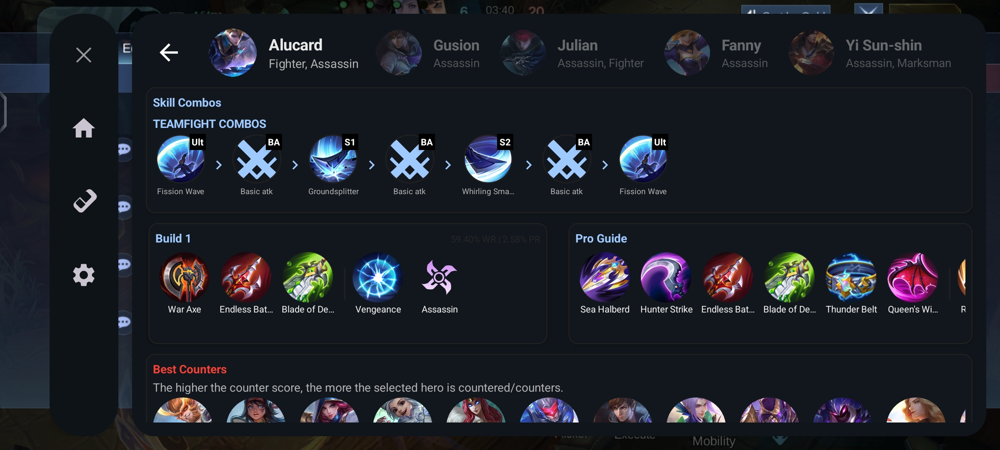
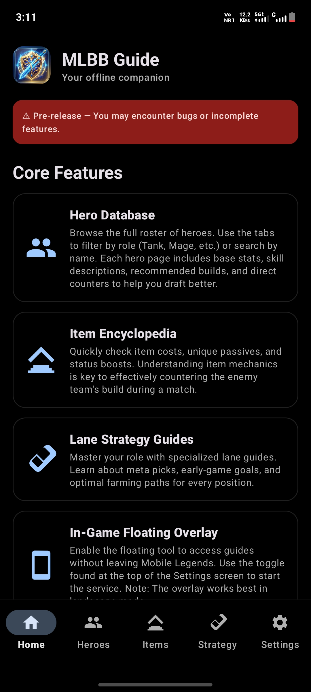
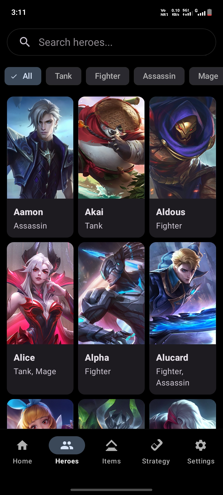
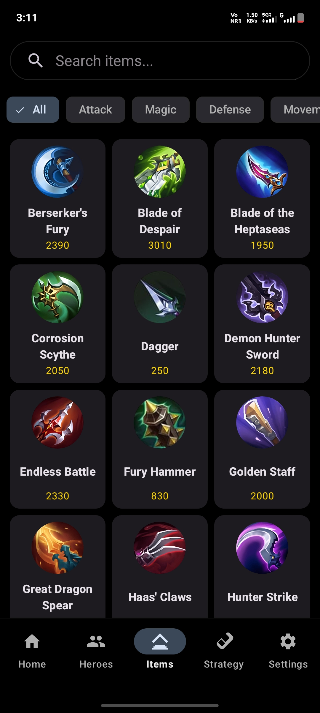
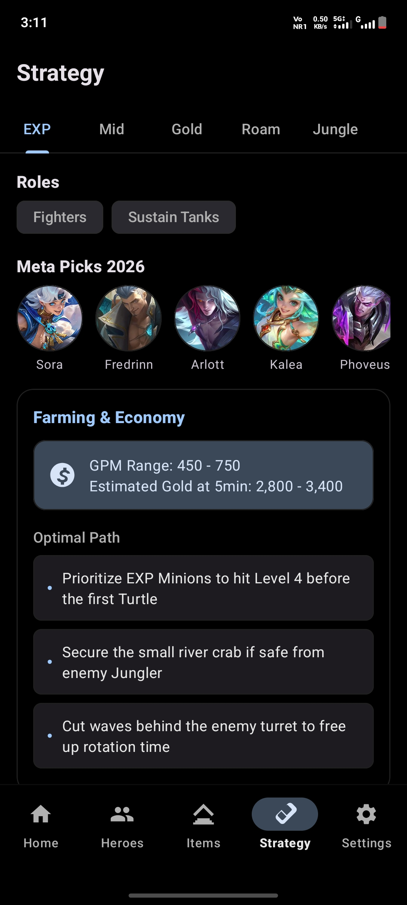
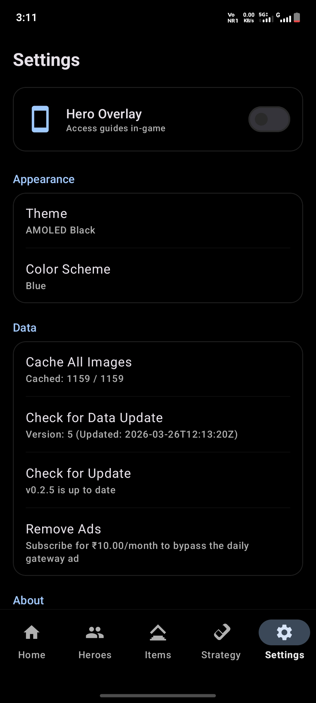
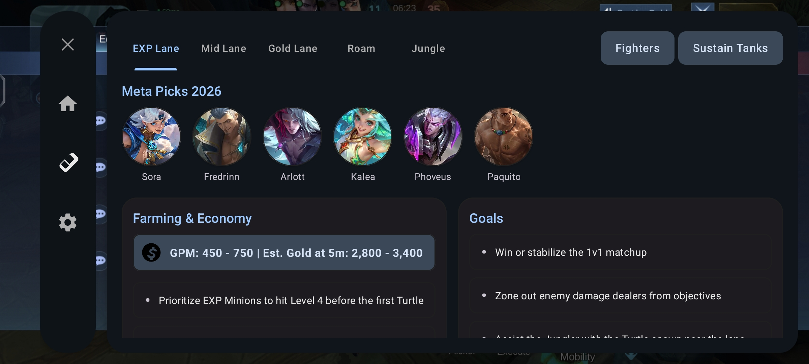

# Battle Buddy

**Master the Land of Dawn with the ultimate offline-first gaming companion.**

---

  
   
  

## 🎯 Repository Purpose

This repository serves as the **official public showcase** and **community hub** for **Battle Buddy**.

While the application's core source code is proprietary, this space is dedicated to:
- **Showcasing Features**: Providing a detailed look at the app's capabilities and design.
- **Bug Reporting**: Ensuring a high-quality experience by tracking and resolving technical issues.
- **Feature Requests**: Collaborating with the community to shape the future of the app.
- **Documentation**: Hosting guides and technical details for users and contributors.

---

## 🚀 The Ultimate Companion

**Battle Buddy** is a premium, high-performance Android application designed for serious Mobile Legends: Bang Bang players. It provides instant, hardware-accelerated access to hero metadata, tactical counters, and item synergies—all without requiring an active internet connection.

### ✨ Key Features

#### 🛡️ In-Game Overlay
Access critical counter-information without ever leaving your match. Our smart, transparent overlay allows you to look up enemies and their weaknesses while you play.

#### 🧠 Enemy Team Analyzer
Input the entire enemy lineup and get instant, tailored recommendations for:
- **Counter Heroes**: Who dominates their picks?
- **Core Items**: What builds shut down their strategy?
- **Tactical Spells**: Which battle spells provide the edge?

#### 🏆 Comprehensive Database
A deep-dive into every hero in the game, including:
- **Skill Breakdowns**: Hardware-rendered skill icons and detailed descriptions.
- **Synergy Maps**: Who are the best teammates for your pick?
- **Lore & Stats**: Background stories and up-to-date base attributes.

---

## 📸 Visual Showcase

| Home | Hero Roster |
| --- | --- |
|  |  |

| Item Database | Strategy |
| --- | --- |
|  |  |

| In-Game Overlay Hero | Settings |
| --- | --- |
|  |    |

| In-Game Overlay Strategy |
| --- |
|  |

---

## 🎨 Design Philosophy

Built with **Material Design 3**, the application features:
- **Dynamic Theming**: Adapts its color palette to your preferences.
- **AMOLED Dark Mode**: True black backgrounds for battery efficiency and high contrast.
- **Hardware Acceleration**: Smooth, 60FPS UI transitions even on lower-end devices.

---

## 🤝 Community & Feedback

This repository serves as the public face of the project. While the core source code remains private to protect proprietary algorithms, we actively encourage community involvement:

- **Bug Reports**: Encountered a data error? [Open a Bug Report](.github/ISSUE_TEMPLATE/bug_report.md).
- **Feature Requests**: Have a new idea for the analyzer? [Suggest a Feature](.github/ISSUE_TEMPLATE/feature_request.md).
- **Strategy Discussion**: Use the Issues section to discuss hero counters and item synergies.

## 📲 Download

**Take your gameplay to the next level.** Download the official **Battle Buddy** app from the Google Play Store and start mastering your matches today: [https://play.google.com/store/apps/details?id=com.divy.mlbbguideoffline](https://play.google.com/store/apps/details?id=com.divy.mlbbguideoffline)

  

## ☕ Support the Developer

If you find **Battle Buddy** helpful and would like to support its ongoing development, feel free to buy me a coffee!

  

---

**Developed by**: Divyanshu Baghel  
**Status**: Active Development  
**License**: MIT (Documentation & Showcase)
